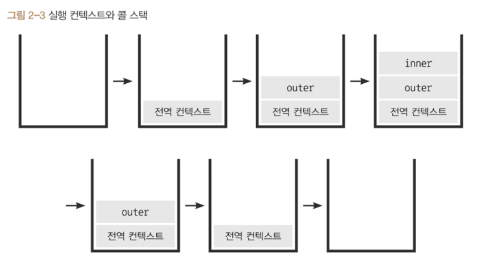
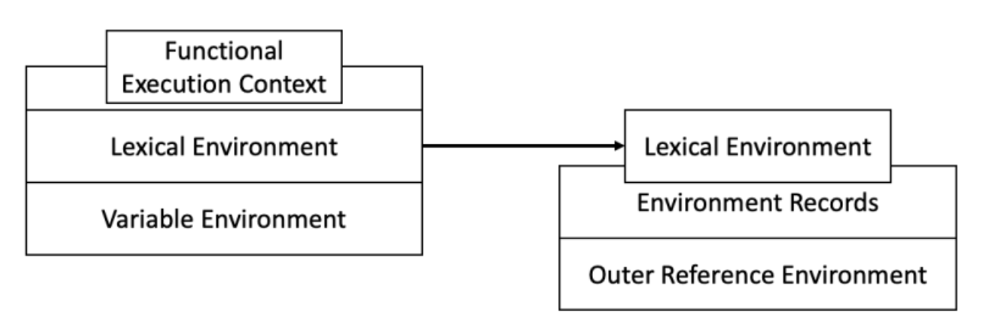

# 02 \_ 실행 컨텍스트

## 1. 실행 컨텍스트란?

실행 컨텍스트는 **`실행할 코드에 제공할 환경 정보들을 모아놓은 객체`** 입니다.
실행 컨텍스트의 생성 과정은 크게 2가지로 나뉩니다.

-   **`평가 과정`**
-   **`실행 과정`**

동일한 환경에 있는 코드들을 실행할 때 필요한 환경 정보들을 모아서 컨텍스트를 구성하고 **`(평가 과정)`** ,
이를 콜스택에 쌓아올렸다가, 가장 위에 쌓여있는 컨텍스트와 관련 있는 코드들을 실행하는 식 **`(실행 과정)`** 으로 이루어집니다.

실행 컨텍스트는 세 가지 종류가 있습니다.

1. 전역 실행 컨텍스트 : 자동으로 생성되는 전역 컨텍스트
2. eval() 함수 컨텍스트 : eval 함수 실행으로 만들어지는 컨텍스트
3. **`함수 실행 컨텍스트`** : 함수 실행으로 만들어지는 컨텍스트

우리는 여기서 3번, **`함수 실행 컨텍스트`** 에 대해 집중적으로 다뤄보겠습니다.

```jsx
// 예제 2-1
// ------------------- (1)
var a = 1;
function outer() {
    function inner() {}
    inner(); // -------- (2)
}
outer(); // -------- (3)
```

콜 스택에 실행 컨텍스트가 어떤 순서로 쌓이고, 어떤 순서로 코드 실행에 관여하는지 예제를 통해 확인하겠습니다.

1. 자바스크립트 코드를 실행하는 순간(1) 전역 컨텍스트가 콜 스택에 담깁니다.
2. 순차적으로 진행하다 (3)에서 outer 함수를 호출하면 전역 컨텍스트와 관련된 코드의 실행을 일시 정지 하고
   자바스크립트 엔진은 outer에 대한 환경 정보를 수집해서 outer 실행 컨텍스트를 생성한 후 콜 스택에 담습니다.
3. outer 함수 내부의 코드들을 순차적으로 실행하다 (2)에서 inner함수의 실행 컨텍스트를 생성한 후 콜 스택에 담습니다.
4. outer 컨텍스트와 관련된 코드의 실행을 일시 정지 후 inner 함수 내부 코드를 순차적으로 실행합니다.
5. inner 함수에서 더 실행할 코드가 없으므로 inner 컨텍스트가 종료 되고 마찬가지로 outer와 전역 컨텍스트도 같은 방식으로 진행되며 종료됩니다.



여기서 실행 컨텍스트의 정의를 되짚어 보겠습니다.
실행 컨텍스트란 **`실행할 코드에 제공할 환경 정보들을 모아놓은 객체`** 입니다.
함수가 호출되며 실행 컨텍스트가 활성화 될 때 그럼 어떤 환경 정보들을 저장할까요?

실행 컨텍스트에 담기는 환경 정보는 다음과 같습니다.

-   `VariableEnvironment`
-   **`LexicalEnvironment`**
-   `ThisBinding`

여기서 우린 2번째 LexicalEnvironment에 대해 자세히 알아보겠습니다.



## 2. VariableEnvironment

실행 컨텍스트를 생성할 때 VariableEnvironment에 정보를 먼저 담고, 이를 그대로 복사해서 LexicalEnvironment를 생성합니다. LexicalEnvironment와는 다르게 최초 실행 시의 정보를 유지합니다.

## 3. LexicalEnvironment

위 사진에서 볼 수 있듯이 LexicalEnvironment에는 2가지가 있습니다.

-   environmentRecord
-   outerEnvironmentReference

### 3-1 environmentRecord와 호이스팅

environmentRecord에는 **현재 컨텍스트**와 관련된 코드의 **식별자** 정보들이 저장됩니다.
컨텍스트 내부 전체를 처음부터 끝까지 쭉 훑어나가며 **순서대로** 수집합니다.

**평가 과정**에서 자바스크립트 엔진은 모든 선언(변수 식별자, 매개 변수 식별자, 함수 선언문 등)을 **선언부**와 **할당부**로 분리해서 **선언부**만을 **`해당 식별자 정보가 속한 스코프의 최상위에 끌어올리듯이 가져오게`** 됩니다. 이를 **`호이스팅`** 이라고 합니다.

그리고 자바스크립트 엔진은 최상위로 끌어온 변수들을 암묵적으로 undefined로 초기화 합니다.

밑의 예제에서 에러가 나지 않는 이유입니다.

**할당부**는 코드의 **실행 과정**에서 실행됩니다.
간단한 예제를 보겠습니다.

```jsx
console.log(x); // undefined
var x = 10;
```

이 코드를 호이스팅 과정을 거친다면 코드가 실제로 바뀌진 않지만 이렇게 끌어올린 것으로 간주할 수 있습니다.

```jsx
var x; // 선언부만 스코프의 최상위에 끌어올려짐
console.log(x); // undefined
x = 10; // 할당부
```

잠깐 함수 선언문과 함수 표현식에 대해 알아보겠습니다.

```jsx
// 원본 코드
function a() {} // 함수 선언문
var b = function () {}; // 함수 표현식
```

함수 선언문은 호이스팅이 되는데 그렇다면 함수 표현식도 호이스팅이 될까요??
정답은 아니오 입니다!

함수 선언문의 경우 선언부에 해당하여 호이스팅 됩니다.
그러나 함수 표현식의 경우 함수라는 값을 변수에 할당 하는 것이므로 선언부만 호이스팅 됩니다.
다음 예제를 보면 쉽게 이해하실 수 있습니다!

```jsx
// 호이스팅 된 코드
var a = function a() {}; // 함수 선언문은 전체를 호이스팅합니다.
var b; // 변수는 선언부만 끌어올립니다.

console.log(a()); // 함수 a의 실행 값
console.log(b()); // Error

b = function () {}; // 변수의 할당부는 원래 자리에 남습니다.
```

### 3-2 스코프, 스코프 체인, outerEnvironmentReference

**`스코프`** 란 **`식별자에 대한 유효범위`** 입니다. 이러한 스코프(식별자에 대한 유효 범위)는 전역 공간을 제외하면 함수에 의해서만 생성됩니다.

스코프의 규칙

-   **하위 스코프는 하위스코프와 하위스코프의 바로 위에 있는 상위스코프에 접근할 수 있습니다.**
-   **상위 스코프는 하위 스코프에 접근할 수 없습니다.**

스코프(식별자의 유효범위)를 **`안에서부터 밖으로 차례로 검색`** 하는 것을 **`스코프 체인`** 이라고 합니다.

이를 가능하게 하는 것이 바로 LexicalEnvironment의 **`outerEnvironmentReference`** 입니다.

스코프 체인

-   outerEnvironmentReference는 현재 호출된 함수가 **`선언될 당시의 LexicalEnvironment`** 를 참조합니다.
    (이를 통해 클로저를 구현할 수 있습니다.)

    쉽게 얘기하자면 **상위 스코프**의 LexicalEnvironment를 참조한다는 것 입니다.

    코드 상에서 어떤 변수에 접근하려고 하면 현재 컨텍스트의 environmentRecord 에서 찾아보고 없으면 outerEnvironmentReference를 통해 상위 컨텍스트의 environmentRecord에서 찾아보는 과정을 반복합니다.
    이런 구조적 특성 때문에 여러 스코프에서 동일한 식별자를 선언한 경우에는 **`무조건 스코프 체인 상에서 가장 먼저 발견된 식별자에만 접근이 가능`** 합니다.

-   outerEnvironmentReference = [ 실행 컨텍스트의 이름, { environmentRecord 객체 } ]

예시를 들어 설명하겠습니다.

```jsx
var a = 1;
var b = 2;
var outer = function () {
    var a = 3;
    var inner = function () {
        console.log(a); // 3
    };
    inner();
    console.log(b); // 2
};
outer();
console.log(a); // 1
```

```jsx
globalExecutionContext = {
	LexicalEnvironment: {
		environmentRecord : {
			a: 1,
            b: 2,
			outer: <function>,
		},
		outerEnvironmentReference : null,
	}
}
outerExecutionContext = {
	LexicalEnvironment: {
		environmentRecord : {
			a:3,
			inner: <function>,
		},
		outerEnvironmentReference : [ global ,{ a: 1,b: 2, outer: <function> }]
	}
}
innerExecutionContext = {
	LexicalEnvironment: {
		environmentRecord : {
		},
		outerEnvironmentReference : [ outer ,{ a: 3, inner: <function> }]
	}
}
```

## 4. this

## 5. 정리

실행 컨텍스트를 배웠으므로 추가로 클로저에 대해 잠깐 알아보겠습니다.

클로저란 함수와 그 함수가 선언됐을 때의 렉시컬 환경과의 조합이다.

실행컨텍스트를 이해했다면 클로저는 매우 쉽습니다!

```jsx
var outer = function () {
    var my_name = "jonguk";
    var inner = function () {
        console.log("hello " + my_name);
    };
    return inner;
};
var sayHello = outer();
sayHello(); // hello jonguk
```

outer의 실행 컨텍스트가 끝났는데 어떻게 my_name을 참조할 수 있을까요?

정답은 inner의 outerEnvironmentReference가 inner함수가 선언될 당시의 LexicalEnvironment를 기억하고 있기 때문입니다.

inner의 environmentRecord에서 my_name을 찾는데 없으므로 스코프 체인을 통해 my_name을 찾습니다. 다행히 outer의 LexicalEnvironment에 my_name이 있으므로 hello jonguk을 출력할 수 있었습니다.

---

마지막으로 전체적인 내용을 정리하며 마무리하겠습니다.

#### 실행 컨텍스트란 "**`실행할 코드에 제공할 환경 정보들을 모아놓은 객체`**" 입니다.

> 실행 컨텍스트의 생성 과정은 크게 "**`평가 과정`**" 과 "**`실행 과정`**"으로 나뉩니다.
>
> 자바스크립트는 **`순차적으로`** 코드를 훑어보며, **`모든 식별자`** 를 "**`선언부`**"와 "**`할당부`**"에서 "**`선언부`**"만을 해당 식별자가 선언된 스코프의 최상위에 끌어올려 암묵적으로 undefined를 할당합니다.
>
> 이를 "**`호이스팅`**"이라 하며 이런 "평가 과정"을 통해 환경 정보들을 수집하여 실행 컨텍스트를 생성합니다.
>
> 생성된 실행 컨텍스트는 콜 스택에 순차적으로 쌓이며 코드가 실행될 때 환경 정보들을 제공합니다. 이런 "실행 과정"을 통해 코드의 순서를 보장합니다.

식별자에는 변수 식별자(var,let,const), 매개변수 식별자, 함수 선언문 등이 있습니다.

#### 함수에는 함수 선언문과 함수 표현식이 있는데

> -   함수 선언문 : 함수 자체가 호이스팅됨
> -   함수 표현식 : 변수에 함수라는 값을 할당하는 것이므로 호이스팅 불가능

#### 실행 컨텍스트에는 다음과 같은 환경 정보들이 있습니다.

> -   VariableEnvironment
> -   **`LexicalEnvironment`**
>> - **`environmentRecord`** : 현재 컨텍스트와 관련된 코드의 식별자 정보들이 담깁니다
>> - **`outerEnvironmentReference`** : 현재 호출된 함수가 선언될 당시의 LexicalEnvironment, 즉 상위 스코프의 LexicalEnvironment를 담고 있습니다.
> -   ThisBinding

#### "**`스코프`**"란 "**`식별자의 유효 범위`**" 입니다.

또한 2가지 규칙이 있습니다.

-   상위 스코프는 하위 스코프에 접근할 수 없다
-   하위 스코프는 하위 스코프와 바로 위에 존재하는 상위 스코프에 접근할 수 있다.

이렇게 스코프를 **`안에서부터 바깥으로 차례로 검색`** 해 나가는 것을 **`스코프 체인`** 이라고 합니다.

스코프 체인이 가능한 이유는 현재 컨텍스트의 outerEnvironmentReference가 상위 컨텍스트의 LexicalEnvironment를 참조하기 때문입니다.
