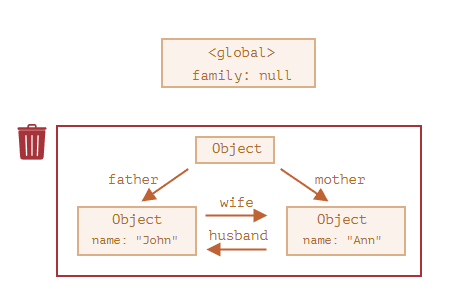

## 클로저

- **함수형 프로그래밍 언어**에서 등장하는 보편적인 특성으로, 자바스크립트만의 특성은 아니다.
```
📌 함수를 선언할 때 만들어진 유효범위가 사라진 후에도 호출할 수 있는 함수?
📌 이미 생명주기 상 끝난 외부 함수의 변수를 참조하는 함수?
📌 함수와 그 함수가 선언될 당시의 lexical environment의 상호관계에 따른 현상?
```
이외에도 다양한 정의가 존재한다. 

> 함수가 선언될 당시의 lexical environment가 뭘까?

### 이쯤에서 다시 복습해보는 실행 컨택스트...

- 실행 컨텍스트 : 실행할 코드에 제공할 환경 정보들을 모아놓은 객체
- 함수를 **실행할 때**, 실행 컨텍스트가 **생성**되어 콜 스택에 쌓인다.

 

- `Lexical Environment` : 현재 컨텍스트 내부의 식별자, 외부 환경를 참조하는 포인터 등의 환경 정보들
  - `Environment Record` : 내부 식별자 (매개변수, 선언된 함수, 선언된 변수)
  - `Outer Environment` : 외부 Lexical Environment을 참조하는 포인터. scope chain이 가능하게 한다.
    - scope chain : 내부 식별자의 유효범위를 안에서부터 바깥으로 차례대로 검색
- 스코프는 함수를 호출할 때가 아니라 함수를 어디에 선언하였는지에 따라 결정된다.


=> 함수가 선언될 당시의 lexical enviroment란, outer environment를 의미한다.
```jsx
function A() {
  ...
  var i;
  function B() { ... }
}
```

- 함수B는 자신이 선언될 당시의 lexical enviroment, 즉 함수A의 lexical environment을 기억한다.
- (= 함수B의 outer 포인터가 A의 l.e를 가르킨다.)
- 함수 B는 함수A에 선언한 변수에 접근 가능하다. ( A에서 B는 불가능)

```
📌 클로저 : 함수와 그 함수가 선언될 당시의 lexical environment의 상호관계에 따른 현상
```
> ex) [함수B] <-> [함수A의 l.e] 

#### 상호 관계?
- 함수 B가 언제나 함수 A의 l.e를 사용하진 않음. 왜?
- 함수 B에서 함수 A 내부의 변수를 참조하지 않는 경우 필요없음.
- **즉, 내부 함수에서 외부 변수를 참조하는 경우에 한해서만 상호 관계가 의미 있다.**

```
📌 클로저는 어떤 함수에서 선언한 변수를 참조하는 내부 함수에서만 발생하는 현상
```
> ex) 함수B에서, 함수A에서 선언한 변수i를 참조하는 경우, 발생하는 현상 => 클로저

#### 내부 함수에서 외부 변수를 참조하는 경우는 어떤 상황일까?

```jsx
var outer = function() { //외부 함수
  var a=1; //외부 변수
  var inner = function(){ //내부 함수
    console.log(++a); //2
  };
  inner();
};
outer(); 
```
- `console.log(++a)` 가 실행될 때, inner 함수 내부에는 선언된 a가 없다.
- inner함수의 environment record에서 값을 못 찾았으므로, inner함수의 outer environment 포인터가 가리키는 `outer함수의 l.e` 에 접근해서 a를 찾는다.
- a를 찾았으므로 2를 출력한다.
- outer() 실행이 모두 종료되면, 실행 컨텍스트가 종료되므로 l.e에 저장된 식별자 a, inner에 대한 참조가 지워진다.
- 참조하는 변수가 사라지므로 GC의 수거 대상이 된다.

#### 조금 내용을 바꿔서, 내부 함수 자체를 반환해 실행하면 어떻게 될까?

```jsx
var outer = function() { //외부 함수
  var a=1; //외부 변수
  var inner = function(){ //내부 함수
    return ++a;
  };
  return inner; // 내부 함수 자체를 반환
};
var outer2 = outer(); // outer2 = inner;
console.log(outer2()) //inner() 실행 => 2
console.log(outer2()) //inner() 실행 => 3
```

- inner함수가 실행되며, outer environment 포인터를 쫓아가며 2, 3이 차례대로 출력된다.
- 이때, outer2함수(=inner함수)가 실행될 때는 이미 outer함수의 실행 컨텍스트가 종료된 상태이다.
- 근데 어떻게 outer함수의 l.e에 접근할 수 있을까?

#### 가비지컬렉터의 동작 방식 때문이다!

- GC는 값을 참조하는 변수가 하나라도 있다면, 수집 대상에서 제외한다.
  - 즉, `도달 가능성(reachability)` 이 있으면, 삭제 x
  - 전역변수는 태생부터 늘 도달 가능... 
- inner함수는 언젠가 outer2를 실행하여 호출될 가능성이 있다.
- 언젠가 inner 함수의 실행 컨텍스트가 활성화되면, inner함수의 outer environment 포인터가 outer함수의 l.e를 필요로하므로(가리키므로) 수집대상에서 제외한다.

=> 함수의 실행 컨텍스트가 종료되어도 l.e가 GC 수집 대상에서 제외되는 경우는, **지역 변수를 참조하는 내부함수가 외부로 전달 될 때!**
 
#### outer함수의 실행 컨텍스트가 종료되었는데, outer함수의 l.e를 어떻게 가리키나요?

- 콜스택에서 어떤 함수의 실행컨텍스트가 제거되었다고해서, 반드시 그 함수의 실행컨텍스트의 lexical environment까지 소멸하는 것은 아니기 때문이다!
- outer함수의 l.e는 inner 함수의 o.e 포인터가 가리키고 있고, inner 함수는 전역 변수 outer2에 의해 참조되고 있기 때문에 GC의 수집 대상에서 제외된다.


```
클로저란, 함수 A에서 선언한 변수i를 참조하는 함수B를 외부로 전달한 경우,
함수A의 실행컨텍스트가 종료된 이후에도 변수 i가 사라지지 않는 현상이다.
```

#### 외부로의 전달은 return말고 콜백함수도 존재한다 -> 뒤에서 다시 설명..

## 클로저와 메모리 관리

- GC의 수거대상이 되지 않도록 개발자가 의도적으로 설계해버린다면? **누수 발생**...
- 클로저는 필요한 지역변수가 메모리를 소모하게 한다. => 필요가 없어지면 메모리를 소모 안하게 하면 된다.
- 참조 카운터를 0으로 만들면 GC가 수거해가므로, 식별자에 참조형이아닌 기본형(`null`, `undefined`)을 할당한다.

```jsx
var outer = function() { //외부 함수
  var a=1; //외부 변수
  var inner = function(){ //내부 함수
    return ++a;
  };
  return inner; // 내부 함수 자체를 반환
};
var outer2 = outer(); // outer2 = inner;
console.log(outer2()) //inner() 실행 => 2
console.log(outer2()) //inner() 실행 => 3

outer2 = null; //outer2식별자의 inner 함수 참조를 끊는다.
```

- outer2 --❌--> inner ----> outer.a
- inner(), outer.a는 참조카운터 0이 되며 GC의 수거 대상이된다.
  - 루트(global)에서 도달할 수 없는 외딴 섬 -> 수거 ⭕
 


## 클로저 활용 사례 - 콜백 함수 내부에서 외부 데이터를 사용하고자 할 때

```jsx
var fruits = ['apple', 'banana', 'peach']
var $ul = document.createElement('ul')

fruits.forEach(function(fruit) { //A
  var $li = document.createElement('li')
  $li.innerText = fruit
  $li.addEventListener('click', function() { //B
    alert('your choice is' + fruit);
  })
  $ul.appendChild($li)
})
document.body.appendChild($ul)
```

<실행 결과>
- apple
- banana
- peach
> 각 li 누를 때마다 해당 과일 이름을 출력하는 팝업이 뜬다.

- A가 3번 실행되며 각 실행컨텍스트가 활성화되며 li는 apple, banana, peach 이름을 갖는다.
- click 이벤트가 발생할 때마다, 각 컨텍스트의 B가 호출되며 외부 변수 fruit을 참조할 예정이므로, fruit는 GC 수집 대상에서 제외된다. <br>
  **=> 클로저!**
- addEventListener은 전역 객체인 DOM의 메소드이므로 가능한 일이다.


```jsx
var fruits = ['apple', 'banana', 'peach']
var $ul = document.createElement('ul')

var alertFruit = function(fruit) { // new!
  alert('your choice is ' + fruit)
}
fruits.forEach(function(fruit) { //A
  var $li = document.createElement('li')
  $li.innerText = fruit
  $li.addEventListener('click', alertFruit); // B함수를 외부로 분리
  })
  $ul.appendChild($li)
})
document.body.appendChild($ul)
```

<실행 결과>
- apple
- banana
- peach
> 각 li 누를 때마다 ' your choice is [object MouseEvent]' 팝업 출력.

#### 왜?
- 콜백 함수인 alertFruit의 파라미터(fruit)에 대한 제어권은 addEventListener이 가진 상태이다.
- addEventListener은 콜백 함수를 호출할 때, **첫번째 인자에 '이벤트 객체'를 주입**하기 때문이다.
  - `...addEventListener('click', (e) => { ... }) //e는 이벤트 객체`
- 고차 함수를 이용하여 해당 현상 해결 가능!
  - `고차 함수` : 함수를 인자로 받거나, 함수를 리턴하는 함수
 

```jsx
var fruits = ['apple', 'banana', 'peach']
var $ul = document.createElement('ul')

var alertFruitBuilder = function(fruit) { // new! 고차함수
  return function() { //익명 함수를 반환
    alert('your choice is ' + fruit)
  } 
}
fruits.forEach(function(fruit) { //A
  var $li = document.createElement('li')
  $li.innerText = fruit
  $li.addEventListener('click', alertFruitBuilder(fruit)); // 현재 fruit 값을 인자로 넘겨주며 실행, 이후 반환된 함수를 콜백함수로 등록.
  })
  $ul.appendChild($li)
})
document.body.appendChild($ul)
```
<실행 결과>
- apple
- banana
- peach
> 각 li 누를 때마다 해당 과일 이름을 출력하는 팝업이 뜬다.

클릭 이벤트가 발생하면, alertFruitBuilder함수의 실행 컨텍스트가 열리면서, alertFruitBuilder함수의 outer environment의 포인터가 외부함수의 l.e를 가리키기 때문에, 외부 파라미터인 fruit를 참조할 수 있다.

#### 천천히 과정을 보면...

1. 클릭하면 `function() { alert(... + fruit) }` 함수 실행
2. fruit을 함수 내부에서 찾으려고 하는데 없음. <= **스코프체인**으로 외부로 나가며 찾아봐야함.
3. 현재 함수의 outer environment의 포인터가 외부 함수인 `function(fruit) { return 본인 }` 의 lexical environment을 가리킨다. <= **fruit찾음!!**
4. fruit에는 이벤트 리스너를 등록하는 과정에서, 각 fruit(apple, banana, peach)의 매개변수 값이 할당되었기 때문에, 정상적으로 클릭한 과일 이름 팝업 출력이 가능하다.

#### 즉, alertFruitBuilder의 실행 결과로 반환된 함수`function() { alert(... + fruit) }` 에는 클로저가 존재한다!

이런식으로 콜백 함수 내부에서 외부 변수를 참조할 수 있다.
