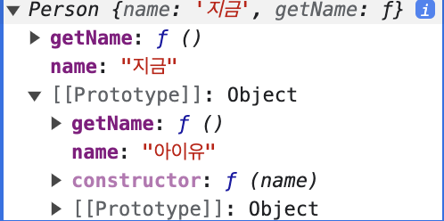
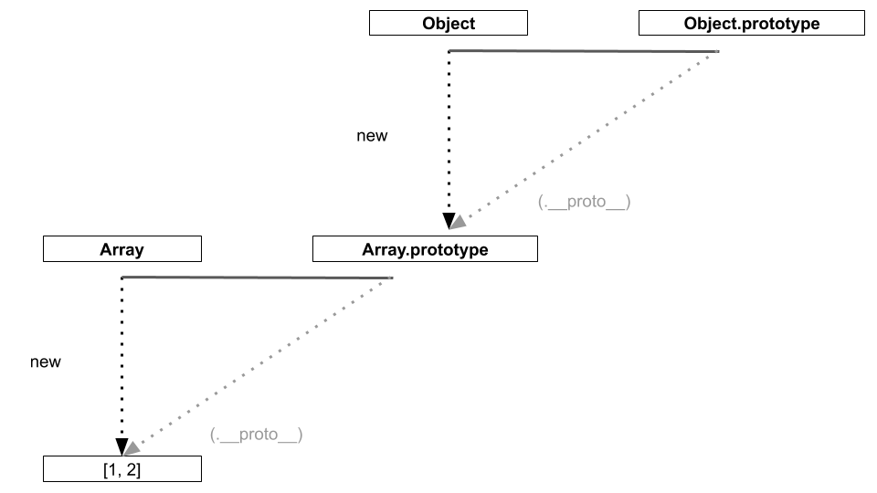
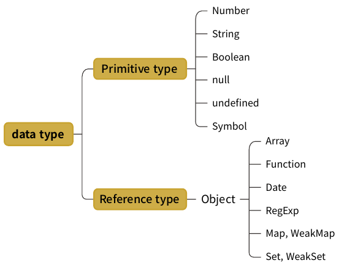

# 05 \_ 프로토타입

## 2. 프로토타입 체인

### 2-1. 메서드 오버라이드

prototype 객체를 참조하는 **`__proto__`** 를 생략하면 인스턴스는 prototype에 정의된 프로퍼티나 메서드를 마치 자신의 것처럼 사용할 수 있습니다.
그런데 만약 인스턴스가 동일한 이름의 프로퍼티 또는 메서드를 가지고 있는 상황이라면 어떨까요?

```jsx
var Person = function (name) {
    this.name = name;
};

Person.prototype.getName = function () {
    return "소중한 " + this.name;
};

var iu = new Person("지금");
iu.getName = function () {
    return "바로 " + this.name;
};
console.log(iu.getName()); // 바로 지금
console.log(iu.__proto__.getName()); // 소중한 undefined

iu.__proto__.name = "아이유";
console.log(iu.__proto__.getName()); // 소중한 아이유
```

**`iu.__proto__.getName`** 와 **`iu.getName`** 은 다릅니다. 그러나 getName이라는 이름이 같습니다. iu.getName()을 실행 하니 **`iu.__proto__.getName`** 이 아닌 **`iu 객체에 있는 getName 메서드`** 가 호출됐습니다. 여기서 일어난 현상을 **`메서드 오버라이드`** 라고 합니다.
여기서 중요한 것은 **`원본을 제거하고 다른 대상으로 교체하는 것이 아니라 원본이 그대로 있는 상태에서 다른 대상을 그 위에 얹었다`** 는 점입니다.

iu 객체를 console에 찍어보면 iu 객체의 getName이 있고 **`iu.__proto__`** 객체에도 getName이 있는 것을 확인할 수 있습니다.



메서드 오버라이드는 그럼 왜 일어나는 것일까요?

앞에서 배운 스코프 체인을 생각하시면 이해가 쉬울 것입니다. 가장 가까운 대상인 자신의 프로퍼티에서 getName이라는 메서드를 검색하고, 없으면 그 다음으로 가까운 대상인 **`__proto__`** 를 검색하는 순서로 진행됩니다.

**`iu.__proto__.getName`** 을 호출했는데 **`undefined`** 가 나온 이유는 this가 prototype객체 (**`iu.__proto__`**) 를 가리키는데 prototype 상에는 name 프로퍼티가 없기 때문입니다.

```jsx
console.log(iu.__proto__.getName()); // 소중한 undefined
```

만약 **`iu.__proto__.name`** 에 새로운 값을 할당하거나 **`Person.prototype.name`** 에 새로운 값을 할당하면 undefined가 나오지 않습니다.

```jsx
iu.__proto__.name = "아이유"; // 현재 Person.prototype.name = '아이유'가 들어가 있습니다.
console.log(iu.__proto__.getName()); // 소중한 아이유
```

**`iu.__proto__.name`** 에 새로운 값을 할당하니 **`Person.prototype.name`** 에 같은 값이 들어갔습니다.
그 이유는 **`__proto__`** 객체가 Person.prototype 객체를 **`참조`** 하고 있기 때문에 call by reference 에 의해 같은 값이 들어간 것이라고 생각합니다.

만약 **`__proto__`** 객체에 있는 getName의 this가 iu 객체를 가리키게 하고 싶다면, 앞에서 배운 **`call, apply`** 로 해결할 수 있습니다.

```jsx
console.log(iu.__proto__.getName.call(iu)); // 소중한 지금
```

### 2-2. 프로토타입 체인

```jsx
const arr = [1, 2];
console.dir(arr);
```

위의 코드를 브라우저에서 출력하면 [[prototype]] : Array 하위에 [[prototype]] : Object가 존재합니다.

여기서 잠깐. prototype의 모양이 조금 다른 점 눈치채셨나요?

> **Array는 왜 `[[prototype]]` 이고 Person 는 왜 `prototype` 일까요???**
>
> **[[prototype]] vs prototype 프로퍼티**
>
> -   **`[[prototype]]`** : **`모든 객체`** 가 갖는 필드. 객체 입장에서 부모역할을 하는 프로토타입 객체를 가리키며, 함수는 Function.prototype. **`__proto__`** 와 동일하다고 보면 된다.
> -   **`prototype 프로퍼티`** : **`함수 객체만`** 갖는 필드. 함수가 **생성자로 사용**될 때, 이로 생성된 객체의 부모역할을 하는 프로토타입 객체를 가리킨다.

다시 돌아와서 [[prototype]] : Array 하위에 [[prototype]] : Object가 존재하는 이유는 바로 prototype 객체가 **`'객체'`** 이기 때문입니다. 기본적으로 모든 객체의 **`__proto__`** 에는 **`Object.prototype`** 이 연결됩니다. 이를 그림으로 표현하면 다음과 같습니다.



**`__proto__`** 는 **`생략 가능`** 하므로 배열 ([1,2])이 Array.prototype 내부의 메서드를 마치 자신의 것처럼 실행할 수 있습니다. 마찬가지로 생략 가능한 **`__proto__`** 를 한 번 더 따라가면 Object.prototype을 참조할 수 있기에 Object.prototype 내부의 메서드도 자신의 것처럼 실행할 수 있습니다.
이렇게 어떤 데이터의 **`__proto__`** 프로퍼티 내부에 다시 **`__proto__`** 프로퍼티가 연쇄적으로 이어진 것을 **`프로토타입 체인`** 이라고 하고, 이 체인을 따라가며 검색하는 것을 **`프로토타입 체이닝`** 이라고 합니다.

생각해보면 자바스크립트에는 배열 말고도 여러가지 자료형이 있습니다.
다른 자료형들도 프로토타입 체이닝을 할 지 잠깐 살펴보겠습니다.



배열, 함수, Date 등은 전부 Object 기반이므로 Object.prototype을 가집니다.
기본형인 Number, String, Boolean은 그럼 어떨까요?

정답은 문자열, 숫자, 불린값을 `Number() , String(), Boolean() 생성자 함수`로 만들면 Object.prototype을 가진다 입니다.

> 문자열과 숫자, 불린값은 객체가 아닙니다. 그런데 이런 기본형의 프로퍼티에 접근하려고 하면 내장 생성자 `String`, `Number`, `Boolean`을 사용하는 임시 래퍼(wrapper) 객체가 생성됩니다. 임시 래퍼 객체는 이런 메서드를 제공하고 난 후에 사라집니다.

### 2-3. 객체 전용 메서드의 예외사항

어떤 생성자 함수이든 prototype은 반드시 객체이기 때문에 최상단에 Object.prototype을 가집니다.

따라서 객체에서만 사용할 메서드는 조금 다릅니다. 만약 다르지 않으면 다른 데이터 타입에서도 해당 메서드를 쓸 수 있기 때문입니다. **`객체 전용 메서드`** 는 Object에 스태틱 메서드로 부여합니다. 예시는 Object.assign() , Object.freeze() 등이 있습니다.

반대로 Object.prototype에는 어떤 데이터에서도 활용할 수 있는 **`범용적인 메서드`** 들만 있습니다.
toString, hasOwnProperty, valueOf, isPrototypeOf 등은 모든 변수가 마치 자신의 메서드인 것처럼 호출할 수 있습니다.

```jsx
const arr = [1, 2];
Array.prototype.toString.call(arr); // 1,2
arr.toString(); // 1,2
```

정리하자면

1. 객체 전용 메서드는 Object.메서드 형태로 이용해야 합니다. 안그러면 모든 데이터 타입에서 접근 할 수 있기 때문입니다.
2. 범용적인 메서드는 Object.prototype에 포함되어 있으므로 모든 변수에서 마치 자신의 메서드인 것처럼 호출하면 됩니다.

> 프로토타입 체인의 최상단에 Object.prototype이 존재합니다.
>
> 다만, 예외적으로 `Object.create(null)`을 사용한 경우 Object.prototype이 없는 객체를 생성합니다. 이 메서드를 사용하면, 내장 메서드 및 프로퍼티들이 제거됨으로써 제약이 생기지만, 객체의 무게가 가벼워지는 성능상 이점을 가져갈 수 있습니다.

### 2-4 다중 프로토타입 체인

사용자는 프로토타입 체인을 연결시켜서 얼마든지 새롭게 만들 수 있습니다.

대각선의 **`__proto__`** 를 연결하는 방법은 **`__proto__`** 가 가리키는 대상, 즉 생성자 함수의 prototype이 연결하고자 하는 상위 생성자 함수의 인스턴스를 바라보게끔 해주면 됩니다.

```jsx
const Grade = function () {
    var args = Array.prototype.slice.call(arguments);
    for (var i = 0; i < args.length; i++) {
        this[i] = args[i];
    }
    this.length = args.length;
};
const g = new Grade(100, 80);
```

변수 g는 Grade의 인스턴스입니다. 여기서 Grade의 인스턴스(g)는 배열의 형태를 지니지만, 배열의 메서드를 사용할 수 없는 유사배열객체입니다. Grade의 인스턴스(g)에서 배열 메서드를 직접 쓰게 하려면 **`g.__proto__`**, 즉 **`Grade.prototype`** 이 **`배열의 인스턴스([])`** 를 바라보게 하면 됩니다.

```jsx
Grade.prototype = [];
```

이 명령에 의해 그림 6-13 이 그림 6-14 처럼 됩니다.

이제는 Grade의 인스턴스인 g에서 직접 배열의 메서드를 사용할 수 있습니다.

이렇게 g 인스턴스는 **프로토타입 체인** 에 따라 **g 객체 자신이 지니는 멤버, Grade의 prototype에 있는 멤버, Array.prototype에 있는 멤버, 끝으로 Object.prototype에 있는 멤버**에까지 모두 접근할 수 있게 됩니다.

```jsx
console.log(g); // Grade(2) [100, 80]
g.pop();
console.log(g); // Grade(1) [100]
g.push(90);
console.log(g); // Grade(2) [100, 90]
```

## 3. 정리

어떤 생성자 함수를 new 연산자와 함께 호출하면 Constructor에서 정의된 내용을 바탕으로 새로운 인스턴스가 생성되는데, 이 인스턴스에는 **`__proto__`** 라는, Constructor의 **`prototype`** 프로퍼티를 참조하는 프로퍼티가 자동으로 부여됩니다. **`__proto__`** 는 **`생략 가능한 속성`** 이라서, 인스턴스는 Constructor.prototype의 메서드를 마치 자신의 메서드인 것처럼 호출할 수 있습니다.

Constructor.prototype의 **`constructor`** 프로퍼티 : 이는 다시 생성자 함수 자신을 가리킵니다. 이 프로퍼티는 인스턴스가 자신의 생성자 함수가 무엇인지를 알고자 할 때 필요한 수단입니다.

직각삼각형의 대각선 방향, 즉 **`__proto__`** 방향을 계속 찾아가면 최상단에 Object.prototype이 존재합니다. 이런 식으로 **`__proto__`** 안에 다시 **`__proto__`** 를 찾아가는 과정을 **`프로토타입 체이닝`** 이라고 합니다. 이 프로토타입 체이닝을 통해 각 프로로타입 메서드를 자신의 것처럼 호출할 수 있습니다. 이때 접근 방식은 자신으로부터 가장 가까운 대상에서 점차 먼 대상으로 나아가며, 원하는 값을 찾으면 검색을 중단합니다. 이름이 같은 메서드가 있어도 원본을 대체하는게 아니라 원본 위에 얹는 **`메서드 오버라이딩`** 현상에서 이를 이용할 수 있습니다.

**`Object.prototype`** 에는 모든 데이터 타입에서 범용적으로 쓸 수 있는 메서드가 있으며, 객체 전용 메서드를 쓰려면 Object.메서드명 으로 써야 합니다.

프로토타입 체인은 사용자가 마음대로 만들 수 있습니다.

**`[[prototype]]`** 프로퍼티는 모든 객체에 존재하며 **`__proto__`** 와 같습니다. **`prototype`** 프로퍼티는 오직 함수 객체에만 존재합니다.
